### RWA Guardian Agent

Team:

```mermaid
flowchart LR
    L1["BLOCKCHAIN <br/>━━━━━━━━━<br/>👤 Rakesh"]
    
    L2["BLOCKCHAIN<br/>━━━━━━━━━<br/>👤 Vinuta"]
    
    AI1["AI/ML<br/>━━━━━━━━━<br/>👤 Tarun"]
    
    UI["AI/ML<br/>━━━━━━━━━<br/>👤 Shine"]
    
    IOT["IoT<br/>━━━━━━━━━<br/>👤 Rabbani"]
    
    L1 ~~~ L2 ~~~ AI1 ~~~ UI ~~~ IOT
    
    style L1 fill:#000000,stroke:#16213e,stroke-width:3px,color:#fff
    style L2 fill:#000000,stroke:#16213e,stroke-width:3px,color:#fff
    style AI1 fill:#16213e,stroke:#0f3460,stroke-width:3px,color:#fff
    style UI fill:#16213e,stroke:#0f3460,stroke-width:3px,color:#fff
    style IOT fill:#1a1a2e,stroke:#16213e,stroke-width:3px,color:#fff
```

Project Summary: The "RWA Guardian Agent" is a specialized, autonomous AI security agent built on the Masumi Network. It is designed to solve the critical "Trilemma of Trust" (Data Fraud, Identity Fraud, and Scalability Failure) for Real-World Assets (RWAs) tokenized on the Cardano blockchain.

Our solution provides a 24/7, verifiable security service. It uses a hybrid AI (Python \+ Node.js) architecture, a Hydra Head (L2) for high-speed real-time IoT data monitoring, and an Aiken (L1) smart contract for on-chain security. The agent's identity is secured by Masumi's Identity & Trust protocol (Atala PRISM), and its findings are recorded immutably using Masumi's "Decision Logging" feature.

---

### 1\. Problem Statement

The tokenization of Real-World Assets (RWAs) is a multi-trillion dollar opportunity, but it is fundamentally blocked by a Critical Trilemma of Trust:

* Data Fraud: On-chain contracts are "blind." They must trust the data they are fed from off-chain oracles and IoT sensors. This "garbage in, garbage out" problem means a single hacked or faulty sensor can be exploited to drain millions from a protocol.  
* Identity Fraud: Who is updating the asset? An anonymous wallet? A hackable, centralized API key? Without a verifiable, on-chain identity for the oracles and agents managing an asset, there is no true accountability or security.  
* Scalability Failure: RWAs generate a constant, high-frequency stream of data (e.g., temperature checks, GPS pings, energy output). L1 blockchains are not built for this. The cost and speed limitations of L1 make real-time monitoring impossible, forcing projects to use centralized databases, which defeats the purpose of decentralization.

---

### 2\. Our Solution: The "RWA Guardian Agent"

Our solution is a complete, end-to-end "trust-as-a-service" agent for RWAs. It is built as an "Agentic Service" on the Masumi Network, integrating four core concepts to solve the trilemma.

1\. Solves Scalability Failure with Hydra (L2)

* What it is: We use a Cardano Hydra Head as a high-speed, off-chain state channel.  
* How we use it: This Hydra Head is our Kodosumi-inspired runtime environment. The AI agent and the (simulated) RWA IoT sensor are both participants. This allows the agent to monitor thousands of "micro-transactions" (e.g., temperature readings) in real-time with sub-second finality and near-zero cost.

2\. Solves Identity Fraud with Masumi (Identity)

* What it is: The Masumi Network protocol provides a foundational "Identity & Trust" layer for AI agents.  
* How we use it: Our "RWA Guardian Agent" is registered on the Masumi Network and issued a Decentralized Identifier (DID) via Atala PRISM. This DID is its permanent, verifiable "passport," allowing it to cryptographically sign all its actions.

3\. Solves Data Fraud with Aiken (L1) & Masumi (Logging)

* What it is: We use Aiken—a modern, secure, and hackathon-friendly smart contract language—to build our L1 "Guard" contract.  
* How we use it (The "Smart Escalation"):  
  * Detection (L2): The agent detects an anomaly in the Hydra Head.  
  * Logging (L1): The agent exits the Head and uses Masumi's "Decision Logging" feature to post an immutable, auditable "FRAUD" record on the L1.  
  * Execution (L1): The agent then calls the Aiken "Guard" Contract, which verifies both the Agent's Atala DID and the Masumi Decision Log. Only if both are valid does it execute the "escalation" and change the RWA's on-chain status to "ALERT\!"

4\. Solves the "AI Problem" with a Hybrid (Python \+ Node.js) Model

* What it is: We use the best tool for each job. A pre-built Python (Flask/FastAPI) AI model, containerized with Docker, handles the complex fraud detection. A Node.js agent handles all the blockchain interactions.  
* How we use it: The Node.js agent (in the Hydra Head) makes a simple REST API call to the Python AI service with the IoT data. This allows us to have a simple, reliable blockchain agent (Node.js) that gets its "brain" from a powerful, easily updatable Python model.

---

### 3\. Architecture & Technical Implementation

Team Roles & Responsibilities:

* Rakesh (Blockchain 1 \- L1):  
  * Task: Develop the AtalaGuard.ak (Aiken) smart contract.  
  * Tech: Aiken, Untyped Plutus Core (UPLC).  
  * Logic: The validator script stores the Agent's Atala DID (PKH) in its datum. The redeemer is the new Status string. The contract must validate the agent's signature and reference a valid Masumi Decision Log.  
* Vinuta (Blockchain 2 \- L2):  
  * Task: Deploy the L2 infrastructure.  
  * Tech: Cardano Node, Hydra Node, Masumi Node.  
  * Logic: Sets up the Hydra Head for the agent and IoT device to communicate. Deploys the Masumi Node (Payment/Registry Services) so the agent can be registered and its logs can be read.  
* Tarun & Shine (AI/ML \- Agent):  
  * Task: Build the "AI Agent" brain and its Masumi integration.  
  * Tech: Python (Flask/FastAPI), Docker, Node.js, MeshSDK, Masumi Protocol SDK.  
  * Logic: (Pre-Hackathon) Build and containerize the Python AI fraud detection model. (Hackathon) The Node.js agent (fraud\_detector.js) reads data from Rabbani's feed. It then makes an API call to the Python AI service (running in Docker). If the AI returns "FRAUD", it triggers the "Escalation" function (logging via Masumi, calling Rakesh's contract via MeshSDK).  
* Shine & Rabbani (UI):  
  * Task: Build the user-facing "Investor Dashboard."  
  * Tech: React, MeshSDK.  
  * Logic: A simple React app that polls Rakesh's L1 contract for the dNFT's current metadata. It automatically updates the UI from "Verified" (Green) to "ALERT\!" (Red) when the "Smart Escalation" is successful.  
* Rabbani (IoT):  
  * Task: Build the simulated RWA data feed.  
  * Tech: Node.js.  
  * Logic: A data\_feed.js script that streams fake JSON data ({temp: 2.1}) into the Hydra Head. It includes a function to manually trigger an anomaly ({temp: 10.5}).

### Process Flow (The "Smart Escalation" Demo):

1. L2 Monitoring (Happy Path): Rabbani's feed streams good data. Tarun's Node.js agent sends this data to the Python AI service, which returns "VERIFIED". Shine's UI polls Rakesh's L1 contract and shows "VERIFIED".  
2. L2 Anomaly: Rabbani triggers the anomaly (temp spikes).  
3. L1 Escalation: The Node.js agent sends the bad data to the Python AI service, which returns "FRAUD". The agent then uses the Masumi Node to log its decision on-chain and calls Rakesh's Aiken contract with a transaction signed by its Atala DID.  
4. L1 Result: The Aiken contract verifies the DID signature and the Masumi log. It executes, updating the dNFT's on-chain metadata.  
5. UI "ALERT\!": Shine's UI polls the L1, sees the new metadata, and instantly flips to "ALERT\!", proving the end-to-end loop is successful.

```mermaid
flowchart LR
    subgraph SETUP["SETUP"]
        START[START] --> DID["AI Agent gets DID<br/>Masumi / Atala"]
        DID --> DEPLOY["Deploy L1<br/>Contract"]
        DEPLOY --> LOCK["Lock dNFT in<br/>Contract"]
    end
    
    subgraph MON["MONITORING L2"]
        IOT["IoT Data → L2<br/>Hydra Head /"] --> ANALYZE["AI Agent Analyzes<br/>Data"]
        ANALYZE --> ANOM{"Anomaly?"}
    end
    
    subgraph ACTION["ACTION L1"]
        VERIFIED["Status:<br/>VERIFIED"]
        EVENT["Event:"] --> FRAUD["Agent logs 'FRAUD'<br/>Masumi Decision"]
        FRAUD --> CALL["Call L1<br/>Contract"]
        CALL --> READ["Contract reads Masumi<br/>log,"]
        READ --> ALERT["Status: ALERT!<br/>UI Polling"]
    end
    
    LOCK -.-> IOT
    ANOM -->|No| VERIFIED
    ANOM -->|Yes| EVENT
    
    style START fill:#1a1a2e,stroke:#16213e,stroke-width:3px,color:#fff
    style DID fill:#16213e,stroke:#0f3460,stroke-width:3px,color:#fff
    style DEPLOY fill:#16213e,stroke:#0f3460,stroke-width:3px,color:#fff
    style LOCK fill:#16213e,stroke:#0f3460,stroke-width:3px,color:#fff
    style IOT fill:#16213e,stroke:#0f3460,stroke-width:3px,color:#fff
    style ANALYZE fill:#533483,stroke:#16213e,stroke-width:3px,color:#fff
    style ANOM fill:#6a0572,stroke:#16213e,stroke-width:3px,color:#fff
    style VERIFIED fill:#2e8b57,stroke:#16213e,stroke-width:3px,color:#fff
    style EVENT fill:#16213e,stroke:#0f3460,stroke-width:3px,color:#fff
    style FRAUD fill:#16213e,stroke:#0f3460,stroke-width:3px,color:#fff
    style CALL fill:#16213e,stroke:#0f3460,stroke-width:3px,color:#fff
    style READ fill:#16213e,stroke:#0f3460,stroke-width:3px,color:#fff
    style ALERT fill:#c41e3a,stroke:#16213e,stroke-width:3px,color:#fff
    style SETUP fill:#0a0e27,stroke:#4a90e2,stroke-width:3px,color:#fff
    style MON fill:#0a0e27,stroke:#533483,stroke-width:3px,color:#fff
    style ACTION fill:#0a0e27,stroke:#6a0572,stroke-width:3px,color:#fff
    
    linkStyle default stroke:#4a90e2,stroke-width:2px
```

---

### 4\. The Future & Business Model (Masumi Ecosystem)

This hackathon project is the foundation for a real, monetizable business.

* Sokosumi (Marketplace): Our "RWA Guardian Agent" is not just a tool; it's a product. We will list it on Sokosumi, the Masumi agent marketplace.  
* Masumi (Payments): Any RWA project on Cardano (a tokenized farm, a supply chain) can discover our agent on Sokosumi and hire it. They will pay it for its 24/7 security service using Masumi's "Agent Payments" protocol.

Our project demonstrates the power of the new agent economy. We are building one of the first, most critical agents—a "Guardian"—that will enable the next generation of secure, autonomous, multi-agent applications on Cardano.

